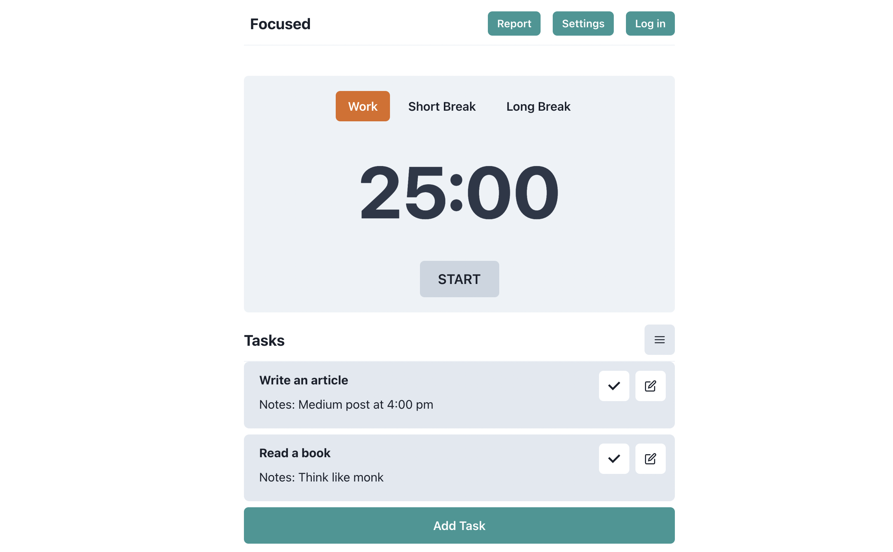

# Focused - A productive react application to focus while working

Focused is an application highly inspired by Pomodoro technique to be productive. The application lets you add your daily tasks and complete them by starting the timer. It also has an option to play music to help you work efficiently.

The application is still in development and is open to public to contribute.

## Current features

1. Add, Edit, Delete Task
2. Start, Stop Timer
3. Load Playlists
4. Load Tracks and Play Music

## Upcoming features

1. Edit timer
2. Dark Mode
3. Reports

## Technologies used

1. React
2. Chakra UI
3. Redux toolkit
4. Rapid API
5. React charts

## Steps

1. Clone the repository
2. Run npm install
3. npm run dev
