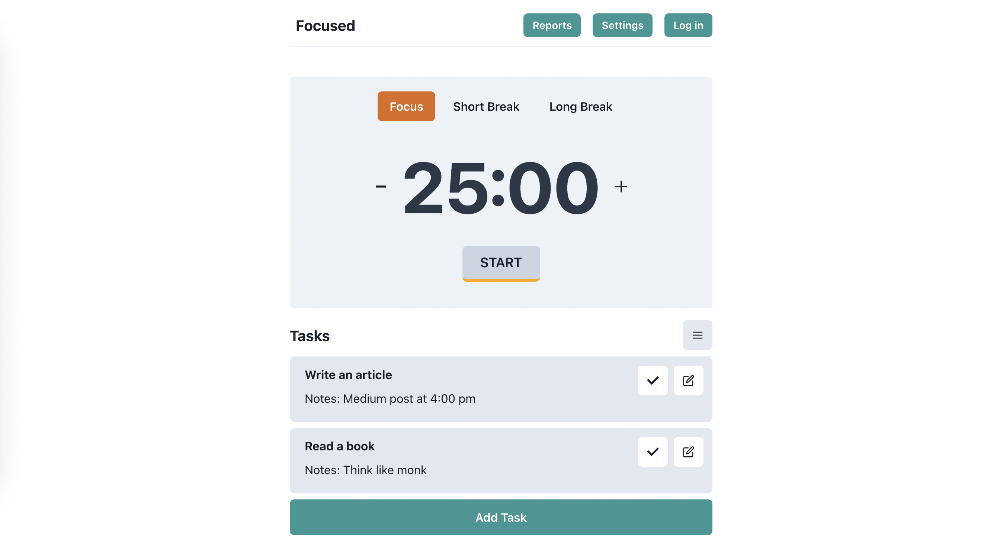

# Focused - A productive react application to focus while working

Focused is an application highly inspired by Pomodoro technique to be productive. The application lets you add your daily tasks and complete them by starting the timer. It also has an option to play music to help you work efficiently.

It also lets you add your Projects and manage tasks within them with a project board.

The application is still in development and is open to public to contribute.

Note: The play music feature is not working due to premium access for spotify.

## Current features

1. Add, Edit, Delete Task
2. Start, Stop and Edit Timer
3. Show completed tasks.
4. Load Playlists
5. Load Tracks and Play Music
6. Generate Reports
7. Project Board

## Upcoming features

1. Theming
2. Projects
3. Sound Alerts

## Technologies used

1. React
2. Chakra UI
3. Redux toolkit
4. Rapid API
5. D3 JS

## Steps

1. Clone the repository
2. Run npm install
3. npm run dev
